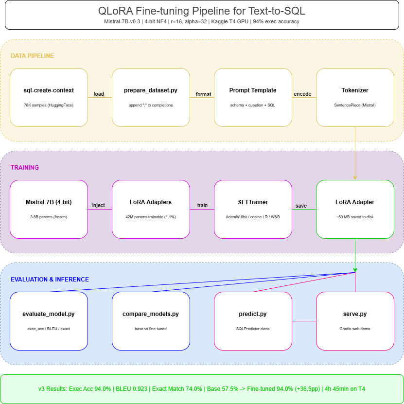

# 🧬 LLM LoRA Fine-Tuning for Text-to-SQL

[](https://www.python.org/downloads/)
[](https://huggingface.co/)
[](LICENSE)
[](https://wandb.ai/)

Fine-tune **Mistral-7B-v0.3** (and other open-source LLMs) for **Natural Language to SQL** generation using **QLoRA** (4-bit quantization + Low-Rank Adaptation). This project documents the **full iterative journey** — from a broken first run to a working pipeline — on the **sql-create-context** dataset (WikiSQL + Spider), using free-tier Kaggle T4 GPUs, with evaluation, experiment tracking, and a deployable Gradio demo.

<p align="center">
  
</p>

---

## 📋 Table of Contents

- [🧬 LLM LoRA Fine-Tuning for Text-to-SQL](#-llm-lora-fine-tuning-for-text-to-sql)
  - [📋 Table of Contents](#-table-of-contents)
  - [✨ Highlights](#-highlights)
  - [🏗️ Architecture](#️-architecture)
  - [📊 Results](#-results)
    - [v1 — Baseline (1 epoch, 20K samples)](#v1--baseline-1-epoch-20k-samples)
    - [v2 — Improved (3 epochs, better decoding) 🔜](#v2--improved-3-epochs-better-decoding-)
  - [🧭 Project Journey](#-project-journey)
    - [Why This Project](#why-this-project)
    - [Iteration Log](#iteration-log)
    - [Key Lessons](#key-lessons)
  - [🚀 Quick Start](#-quick-start)
    - [1. Clone \& Install](#1-clone--install)
    - [2. Configure](#2-configure)
    - [3. Prepare Data](#3-prepare-data)
    - [4. Train](#4-train)
    - [5. Evaluate](#5-evaluate)
    - [6. Demo](#6-demo)
  - [📦 Dataset](#-dataset)
    - [Prompt Format](#prompt-format)
  - [🏋️ Training](#️-training)
    - [QLoRA Configuration](#qlora-configuration)
    - [Launch Training](#launch-training)
  - [📏 Evaluation](#-evaluation)
    - [Metrics](#metrics)
  - [🖥️ Inference \& Demo](#️-inference--demo)
    - [Single Query](#single-query)
    - [Gradio Demo](#gradio-demo)
  - [📁 Project Structure](#-project-structure)
  - [⚙️ Configuration](#️-configuration)
  - [💻 Hardware Requirements](#-hardware-requirements)
  - [🙏 Acknowledgements](#-acknowledgements)
  - [📄 License](#-license)

---

## ✨ Highlights

- **QLoRA (4-bit)** — Fine-tune a 7B-parameter model on a single free-tier **T4 GPU** (Kaggle/Colab)
- **Text-to-SQL** — Practical, real-world task connecting to enterprise NL2SQL applications
- **Iterative Journey** — Documented end-to-end: from broken first run → working pipeline → improved results
- **Full Pipeline** — Data prep → Training → Evaluation → Inference → Gradio Demo
- **Experiment Tracking** — Weights & Biases integration with loss curves and eval metrics
- **Rigorous Evaluation** — Execution accuracy (SQL against SQLite), BLEU, exact-match, and error categorization
- **Multi-Model Support** — Config-driven; swap Mistral for Llama 3.1 8B, CodeLlama, Phi-3, or Qwen2
- **Deployable** — LoRA adapter → Hugging Face Hub → Gradio demo

---

## 🏗️ Architecture

```
┌─────────────────────────────────────────────────────────────────┐
│                        QLoRA Fine-Tuning                        │
│                                                                 │
│  ┌──────────┐    ┌───────────┐    ┌───────────────────────────┐ │
│  │ Dataset   │───▶│  Tokenizer │───▶│  Mistral-7B (4-bit NF4)  │ │
│  │ (SQL-     │    │  + Prompt  │    │  + LoRA Adapters (r=16)  │ │
│  │  Create-  │    │  Template  │    │  Trainable: ~0.6% params │ │
│  │  Context) │    └───────────┘    └──────────┬────────────────┘ │
│  └──────────┘                                 │                  │
│                                               ▼                  │
│  ┌──────────────────────────────────────────────────────┐       │
│  │  SFTTrainer (TRL)                                     │       │
│  │  • Paged AdamW 8-bit optimizer                        │       │
│  │  • Cosine LR schedule                                 │       │
│  │  • Gradient checkpointing                             │       │
│  │  • W&B logging                                        │       │
│  └──────────────────────────────────────────────────────┘       │
│                          │                                       │
│                          ▼                                       │
│  ┌──────────────┐  ┌──────────────┐  ┌───────────────────┐     │
│  │ LoRA Adapter  │  │ Merged Model │  │ Gradio Demo       │     │
│  │ (~50 MB)      │──▶│ (FP16/GGUF) │──▶│ + HF Hub Upload  │     │
│  └──────────────┘  └──────────────┘  └───────────────────┘     │
└─────────────────────────────────────────────────────────────────┘
```

---

## 📊 Results

### v1 — Baseline (1 epoch, 20K samples)

> Trained on Kaggle T4 GPU · Mar 15–16, 2026 · `training_config_t4.yaml`

| Metric | Value |
|--------|-------|
| **Execution Accuracy** | **8.0%** |
| Exact Match | 0.0% |
| Valid SQL Rate | 100.0% |
| Avg BLEU | 0.0815 |
| Train Loss | 0.07483 |
| Best Eval Loss | 0.04429 (step 600, epoch 0.48) |
| Trainable Params | 41,943,040 (~42M) · 1.10% of 3.8B quantized params |
| Training Time | ~6h 52min on Kaggle T4 (24,720 s) |
| Peak VRAM | ~5.4 GB peak allocated |

**Error Distribution (v1):**

| Error Type | Count | % |
|------------|-------|---|
| `runtime_error` (repetitive SQL) | 72 | 72% |
| `wrong_column` | 19 | 19% |
| `logic_error` | 9 | 9% |

**Diagnosis:** The model learned valid SQL syntax (100% parseable!) but generates endlessly repetitive `AND` clauses. Root cause: weak repetition penalty (1.1) + sampling-based decoding + only 1 epoch of training.

<details>
<summary>🔍 Example: v1 failure mode (click to expand)</summary>

```
Q: When Essendon played away; where did they play?

Gold: SELECT venue FROM table_name_50 WHERE away_team = "essendon"

Pred: SELECT venue FROM table_name_50 WHERE away_team = "essendon" AND
      home_team = "melbourne" AND score = "essendon 18 melbourne 18" AND
      home_team = "melbourne" AND away_team = "essendon" AND ...
      (repeats until max_new_tokens)
```

The model gets the right start (`SELECT venue ... WHERE away_team = "essendon"`) but keeps generating redundant conditions.

</details>

### v2 — Improved (3 epochs, better decoding) 🔜

**Changes applied for v2:**
- Epochs: 1 → **3** (more training to learn when to stop)
- Decoding: `do_sample: true` → **`do_sample: false`** (deterministic greedy)
- Repetition penalty: 1.1 → **1.3** (penalise repeated tokens harder)
- Max new tokens: 256 → **128** (SQL queries rarely exceed 128 tokens)

| Metric | v1 | v2 | Δ |
|--------|----|----|---|
| Execution Accuracy | 8.0% | — | — |
| Valid SQL Rate | 100.0% | — | — |
| BLEU | 0.0815 | — | — |

> *v2 results will be filled in after the next Kaggle training run.*

<details>
<summary>📈 Training Loss Curve (click to expand)</summary>


</details>

---

## 🧭 Project Journey

### Why This Project

I wanted to go beyond "run someone else's notebook" and build an **end-to-end LLM fine-tuning pipeline from scratch** — something I could talk about in depth during interviews. Text-to-SQL was the perfect task: it's a real enterprise use case, the evaluation is objective (you can execute the SQL), and the dataset is publicly available.

The goal was never just "get high accuracy" — it was to **understand every piece**: quantization, LoRA math, tokenizer quirks, trainer internals, evaluation pitfalls, and what breaks when you move from a tutorial to real hardware.

### Iteration Log

<details open>
<summary><strong>🔧 v0 — Getting it to run at all</strong></summary>

The first attempt on Kaggle hit **6 distinct errors** before training even started:

| # | Error | Root Cause | Fix |
|---|-------|------------|-----|
| 1 | `AttributeError: total_mem` | PyTorch API change — `total_mem` → `total_memory` | Updated VRAM check code |
| 2 | `ImportError: FlashAttention2` | Flash Attention not available on T4 | Switched to `attn_implementation="eager"` |
| 3 | `KeyError: 'lora_alpha'` | Config key mismatch (`alpha` vs `lora_alpha`) | Fixed YAML → Python key mapping |
| 4 | `TypeError: unexpected kwarg` | TRL version dropped `max_seq_length`/`packing` from SFTConfig | Removed unsupported args |
| 5 | `ValueError: --tf32` | TF32 requires Ampere+ GPU (T4 is Turing) | Set `tf32: false` in T4 config |
| 6 | `KeyError: 'completion'` | TRL SFTTrainer expected `prompt`+`completion` fields | Added `completion` field to dataset prep |

**Lesson:** Moving from an A100 tutorial to a free-tier T4 is 80% debugging environment differences, 20% actual ML.

</details>

<details open>
<summary><strong>📊 v1 — First successful training run</strong></summary>

**Config:** 1 epoch · 20K samples · Kaggle T4 · ~6h 52min

**Results:**
- ✅ Valid SQL: 100% — the model learned SQL syntax
- ⚠️ Execution accuracy: 8% — but it can't produce *correct* SQL
- ❌ Exact match: 0% — repetitive generation ruins every prediction

**What I learned:**
1. 100% valid SQL after just 1 epoch is actually a strong signal — the model has the right idea
2. The repetition problem isn't a model quality issue, it's a **decoding configuration issue**
3. `repetition_penalty: 1.1` is far too weak for SQL generation — the model loops `AND col = "val"` endlessly
4. Using `do_sample: true` at eval time adds randomness that hurts structured output tasks

</details>

<details>
<summary><strong>🚀 v2 — Fixing decoding + more training (in progress)</strong></summary>

**Changes:**
- 3 epochs instead of 1 (let the model see more examples and learn stopping behaviour)
- Deterministic greedy decoding (`do_sample: false`)
- Stronger repetition penalty (1.1 → 1.3)
- Shorter max generation (256 → 128 tokens)

**Expected impact:**
- `runtime_error` count should drop dramatically (the 72% repetitive failures)
- Execution accuracy should improve significantly
- BLEU should increase as predictions become shorter and more precise

*Results will be updated after the next Kaggle run.*

</details>

### Key Lessons

1. **Environment portability is non-trivial.** A config that works on A100 needs 6+ changes for T4. Build configs per hardware tier from the start.
2. **100% valid SQL ≠ correct SQL.** Syntax is easy; semantics is hard. Evaluation must include execution accuracy.
3. **Decoding matters as much as training.** The same model checkpoint can go from 8% → much higher just by fixing `repetition_penalty` and `do_sample`.
4. **Start small, validate, iterate.** Running 1 epoch on 20K samples first — instead of 3 epochs on 78K — saved hours and surfaced all the real issues early.
5. **Document the failures.** The error log above is more valuable in an interview than the final accuracy number.

---

## 🚀 Quick Start

### 1. Clone & Install

```bash
git clone https://github.com/visheshgupta29/llm-lora-finetuning.git
cd llm-lora-finetuning

# Create virtual environment
python -m venv .venv
source .venv/bin/activate  # Linux/Mac
# .venv\Scripts\activate   # Windows

# Install dependencies
pip install -r requirements.txt
```

### 2. Configure

```bash
cp .env.example .env
# Edit .env with your HuggingFace token and W&B API key
```

### 3. Prepare Data

```bash
python -m src.data.prepare_dataset
```

### 4. Train

```bash
python -m src.train.finetune_lora --config configs/training_config.yaml
```

### 5. Evaluate

```bash
python -m src.evaluate.evaluate_model \
    --adapter-path outputs/checkpoint-best \
    --test-split data/processed/test.jsonl
```

### 6. Demo

```bash
python -m src.inference.serve
# Opens Gradio interface at http://localhost:7860
```

---

## 📦 Dataset

We use [**b-mc2/sql-create-context**](https://huggingface.co/datasets/b-mc2/sql-create-context) — a curated combination of **WikiSQL** and **Spider** datasets containing ~78K examples of:

- **Natural Language Question** — e.g., *"How many employees earn more than 50000?"*
- **SQL CREATE TABLE Context** — The schema of relevant tables
- **Gold SQL Query** — The correct SQL answer

### Prompt Format

```
### Task: Generate a SQL query to answer the following question.

### Database Schema:
CREATE TABLE employees (
    id INTEGER PRIMARY KEY,
    name TEXT,
    salary REAL,
    department TEXT
);

### Question:
How many employees earn more than 50000?

### SQL Query:
SELECT COUNT(*) FROM employees WHERE salary > 50000;
```

---

## 🏋️ Training

### QLoRA Configuration

| Parameter | A100 Config | T4 Config | Rationale |
|-----------|------------|-----------|----------|
| Quantization | NF4 (4-bit) | NF4 (4-bit) | Best quality for 4-bit per QLoRA paper |
| Compute dtype | bfloat16 | **float16** | T4 lacks bfloat16 support |
| LoRA Rank (r) | 16 | 16 | Good accuracy/efficiency tradeoff |
| LoRA Alpha | 32 | 32 | Standard α = 2r scaling |
| LoRA Dropout | 0.05 | 0.05 | Light regularization |
| Target Modules | All 7 linear layers | All 7 linear layers | Maximum quality |
| Learning Rate | 2e-4 | 2e-4 | Standard for QLoRA |
| LR Schedule | Cosine | Cosine | Smooth decay |
| Batch Size | 4 (eff. 16) | **2 (eff. 16)** | Halved batch, doubled grad accum |
| Max Seq Length | 1024 | **512** | Most SQL fits in 512 tokens |
| Epochs | 3 | **3** (v2) | v1 used 1; bumped after validation |
| Precision | bf16 | **fp16** | T4 hardware constraint |
| TF32 | true | **false** | Ampere-only feature |

### Launch Training

```bash
# Single GPU
python -m src.train.finetune_lora --config configs/training_config.yaml

# With custom overrides
python -m src.train.finetune_lora \
    --config configs/training_config.yaml \
    --model-name "meta-llama/Llama-3.1-8B" \
    --lora-r 32 \
    --epochs 5

# Resume from checkpoint
python -m src.train.finetune_lora \
    --config configs/training_config.yaml \
    --resume-from outputs/checkpoint-500
```

---

## 📏 Evaluation

### Metrics

- **Execution Accuracy** — Execute both predicted and gold SQL against SQLite; compare result sets
- **Exact String Match** — Normalized SQL string comparison
- **BLEU Score** — N-gram overlap between predicted and gold SQL
- **Valid SQL Rate** — % of predictions that parse without syntax errors
- **Error Categorization** — Breakdown of failure modes (syntax, wrong table, wrong column, logic, etc.)

```bash
# Full evaluation with all metrics
python -m src.evaluate.evaluate_model \
    --adapter-path outputs/checkpoint-best \
    --test-split data/processed/test.jsonl \
    --run-execution-accuracy

# Compare base model vs fine-tuned
python -m src.evaluate.compare_models \
    --base-model "mistralai/Mistral-7B-v0.3" \
    --adapter-path outputs/checkpoint-best \
    --num-samples 200
```

---

## 🖥️ Inference & Demo

### Single Query

```python
from src.inference.predict import SQLPredictor

predictor = SQLPredictor(adapter_path="outputs/checkpoint-best")

result = predictor.predict(
    question="What are the top 5 departments by average salary?",
    schema="CREATE TABLE employees (id INT, name TEXT, salary REAL, department TEXT);"
)
print(result)
# SELECT department, AVG(salary) as avg_salary FROM employees
# GROUP BY department ORDER BY avg_salary DESC LIMIT 5;
```

### Gradio Demo

```bash
python -m src.inference.serve
```

Launches an interactive web UI where you can:
- Input natural language questions
- Paste or select a database schema
- See the generated SQL with syntax highlighting
- Compare base model vs. fine-tuned output side-by-side

---

## 📁 Project Structure

```
llm-lora-finetuning/
├── configs/
│   ├── training_config.yaml        # A100/high-end GPU config
│   └── training_config_t4.yaml     # T4/free-tier config (Kaggle/Colab)
├── src/
│   ├── data/
│   │   ├── prepare_dataset.py      # Download, clean, split, save
│   │   └── prompt_templates.py     # Prompt formatting for different models
│   ├── train/
│   │   ├── finetune_lora.py        # Main QLoRA training script
│   │   └── callbacks.py            # Custom W&B + early stopping callbacks
│   ├── evaluate/
│   │   ├── evaluate_model.py       # All eval metrics
│   │   └── compare_models.py       # Base vs. fine-tuned comparison
│   └── inference/
│       ├── predict.py              # Programmatic inference
│       └── serve.py                # Gradio web demo
├── notebooks/
│   ├── 00_free_tier_quickstart.ipynb  # One-click Kaggle/Colab pipeline
│   └── 01_exploration_and_training.ipynb
├── scripts/
│   ├── train.sh                    # One-click training launcher
│   └── evaluate.sh                 # One-click evaluation
├── tests/
│   └── test_data_pipeline.py       # Unit tests for data processing
├── assets/                         # Screenshots, diagrams
├── .env.example
├── .gitignore
├── requirements.txt
├── pyproject.toml
├── LICENSE
└── README.md
```

---

## ⚙️ Configuration

All training parameters live in [`configs/training_config.yaml`](configs/training_config.yaml). Key sections:

```yaml
model:
  name: "mistralai/Mistral-7B-v0.3"   # Swap model here
  max_seq_length: 1024

lora:
  r: 16
  alpha: 32
  dropout: 0.05

training:
  epochs: 3
  batch_size: 4
  learning_rate: 2e-4
```

See the full config file for all options.

---

## 💻 Hardware Requirements

| Setup | VRAM | Training Time (est.) | Notes |
|-------|------|---------------------|-------|
| 1× A100 (40 GB) | ~18 GB | ~1.5 hrs (3 epochs, full dataset) | Recommended |
| 1× RTX 4090 (24 GB) | ~20 GB | ~2.5 hrs | Works great |
| 1× RTX 3090 (24 GB) | ~22 GB | ~3.5 hrs | Reduce batch size if OOM |
| **1× T4 (16 GB)** 🆓 | **~5.4 GB peak** | **~6h 52min (1 ep, 20K samples) / ~20+ hrs (3 ep, est.)** | **Kaggle/Colab free tier — tested ✅** |
| CPU only | 32+ GB RAM | ~days | Not recommended; for testing only |

---

## 🙏 Acknowledgements

- [QLoRA Paper](https://arxiv.org/abs/2305.14314) — Dettmers et al.
- [LoRA Paper](https://arxiv.org/abs/2106.09685) — Hu et al.
- [Hugging Face PEFT](https://github.com/huggingface/peft)
- [TRL (Transformer Reinforcement Learning)](https://github.com/huggingface/trl)
- [sql-create-context Dataset](https://huggingface.co/datasets/b-mc2/sql-create-context)
- [Spider Benchmark](https://yale-lily.github.io/spider)

---

## 📄 License

This project is licensed under the MIT License — see [LICENSE](LICENSE) for details.

---

<p align="center">
  Built by <a href="https://github.com/visheshgupta29">Vishesh Gupta</a> · 
  ⭐ Star this repo if you find it useful!
</p>
